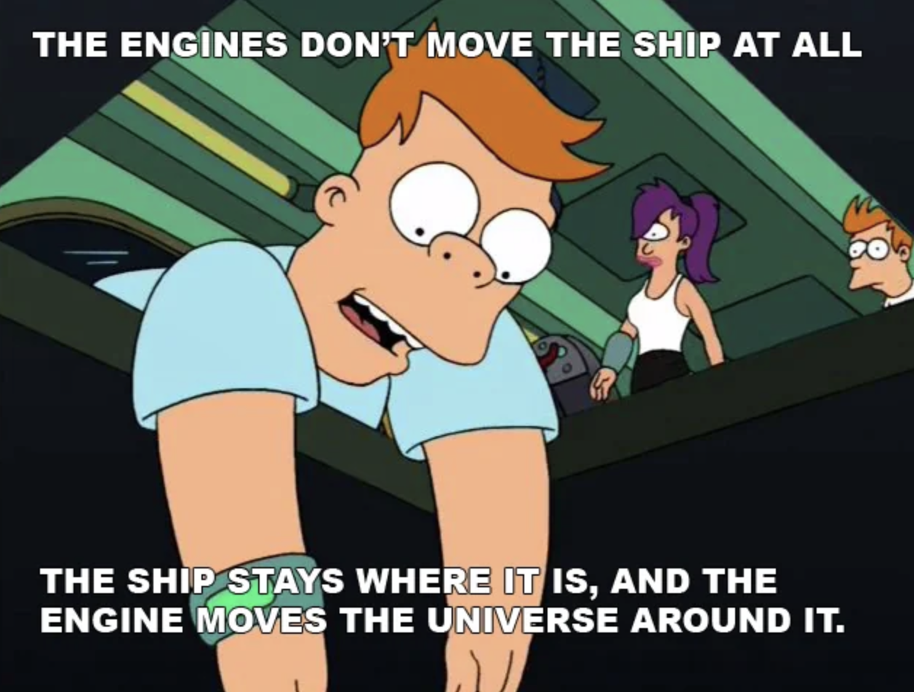
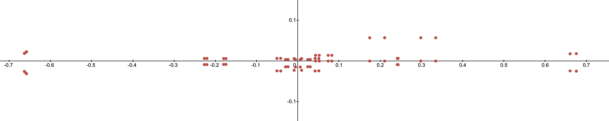
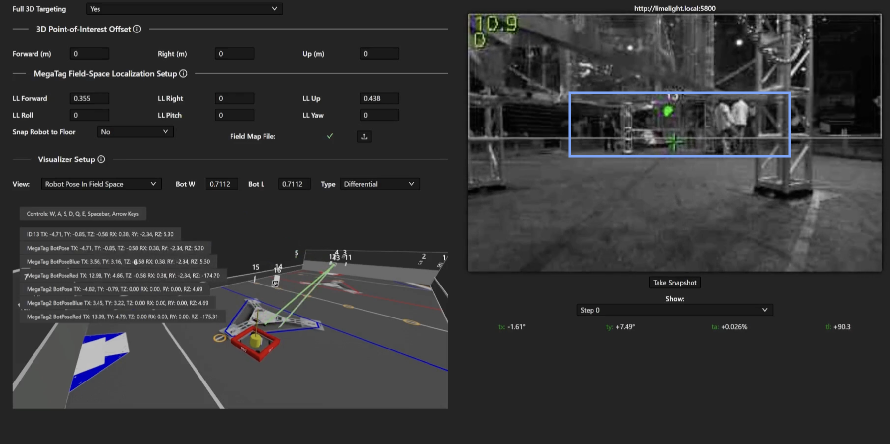

# Dynamic Crop with Limelights

Last Updated: May 2024

## Introduction

Limelights are relatively low power embedded devices. The devices need to be efficient to produce accurate results at a reasonable pace for the accuracy of the system to succeed. There are many options and trade offs that Limelight offers to improve update rates. For instance, in the input tab you can choose a higher resolution for typically better accuracy at range, or higher framerates for a larger sampling rate at the expense of the other.

These decisions are common with embedded devices. Not all tradeoffs are simple inversely proportional mechanisms. Sometimes the tradeoffs cost delicate continuous calibration, other times a chance of failure, or perhaps the complexity of the system risks maintainability and being bug free. This is the nature of systems architecture with embedded systems. The processing bandwidth and real time response speed only gives a finite value and it's up to the software and system engineers to maximize that potential.

A more advanced skill in many computing fields is to process smaller more meaningful bits of data. This is a trade-off of efficiency for complexity. In computer vision, this a smaller sub image with many different names. A common synonym is called cropping an image. So lets take a look at how we can leverage a more intelligent system for picking the right area to look at in an image frame, and be smart with how we handle complexity.

## Detour: Other Disciplines

Before looking at FRC style robotics, lets take a look at other fields and how they handle certain problems.

### Video Games

Kings and queens of efficient programming and computational math. Video games have a long history of finding the easiest ways to calculate something. Predominantly using linear algebra, video games are fundamentally built around these ideas of transformation matrices and ray calculations. In order to improve the _rendering efficiency_, the rendering engine will pick and choose what goes on screen. There's several ways to accomplish this, and the techniques are referred to as culling. Projection (or frustum) culling, occlusion queries, portal culling, back face culling, the list goes on. Game designers have come up with a lot of ways to not have to do work!

I'm going to pick one specifically for this topic: Projection Culling. Frequently called Frustum Culling because of the frustum matrix's prevalence in game design, this cropping happens after transforming vertices into screen space from camera space. Based on the field of view of a camera, all points within sight are typically scaled into a box ranging from [-1, 1] in the x and y direction, and [0, 1] in the z direction. Anything outside these bounds can be discarded, because it's not in view!

A brief [Twitter Video](https://twitter.com/noclipvideo/status/1354169521326542848) featuring Michiel van der Leeuw that illustrates this concept can be found within a documentary on the game Horizon: Zero Dawn. The rectangular pyramid in blue that swirls around is the view frustum. Notice that around the edges of the frustum objects pop in and out of existence. This is projection culling! The view projection matrix allows us to easily identify what exists and where in the computer monitor's screen.

### Security

Take a security camera. It's a particularly uneventful day, and the only thing moving is the grass wiggling in the wind. It's a low power system, trying as hard as possible to be negligent during downtime. Low framerate, low resolution, low power draw. Around the corner walks a person, and the camera takes notice. The camera zooms in on the person, the resolution increases, and the device calculates something called a _chip_. Sometimes this is called a window, subframe, or region of interest. This subregion enables the device to focus on a smaller slice of more important data, and trigger on demand. This is a core technique to computer vision and signal processing since it allows the system to swap parameters as it needs. Adjust exposure times, processing power, data storage, etc. It's a classic work smarter - not harder move.

## April Tags

Part of localization is to identify what even is an april tag. Even before we can start getting a pose relative to the tag, we need to find it in the image first. The [april tag detection process](https://april.eecs.umich.edu/media/pdfs/wang2016iros.pdf) does an adaptive threshold, segmentation, quad identification, and then finally matches the quad pattern to a tag ID. This is a lot of work to run over a large image frame, especially if you realized that you were never going to find an april tag at the bottom of the image frame for your camera install orientation.

Limelight has support for setting the crop of initial image frame. Even better than just that, it's configurable from NetworkTables. We have the ability to change our region of interest procedurally as our robot moves around the field. Typically this is handled in the image processing stack, but given that Limelight is a black box we can find workarounds.

### Prep Work

In order to generate model points, we need to know both the transform and the model points. For simplicity's sake, and since the model transform never changes during a match, we bake them into the creation of the tag. Each resulting ll, lr, ur, and ul point are a corner of the april tag. This saves us the effort of having to multiply the transform against the vector every time we use it. The latter is what video games do because animations change the transform matrix. Those familiar know this as the _model transformation matrix_ in the model&rarr;view&rarr;projection sequence. In other words, we can move each corner of the april tag to where it exists in the game field, be it over the stage, under the speaker, etc using a single transformation matrix for each of the 4 corners.

Given the following sample code to calculate the lower left corner of the april tag, what would you change for the other 3 corners?

```java
public AprilTag(Matrix<N4, N4> transform, double sizeInMeters) {
  Matrix<N4, N1> ll =
    convertCenteredPoseToWPIBluePose(
      transform.times(
        VecBuilder.fill(0, -0.5*sizeInMeters, -0.5*sizeInMeters, 1)
      )
    )
  Matrix<N4, N1> lr = ...
  Matrix<N4, N1> ur = ...
  Matrix<N4, N1> ul = ...
}
```

_This article will not address row versus column major, just know that the order of the multiplication matters. Matrix multiplication is not commutative!_

_Additionally, we're skipping the homogenous coordinate discussion. That trailing 1 is important._

In order to stay consistent and mitigate against potential error sources, it's easiest to load the exact same dataset as the limelight does. Thankfully, WPILib includes a json parser called Jackson. So loading the files up into a series of points is nearly plug and play. Each tag (also called a _fiducial_) is listed in the fmap with 5 fields: _family, id, size, transform,_ and _unique_. In 2024s game Crescendo, the family, size, and unique values were consistent across all tags.

```java
public ArrayList<AprilTag> LoadTagLocations(String fmap_path) {
  ArrayList<AprilTag> tags = new ArrayList<>();
  JsonNode productNode =
    new ObjectMapper().readTree(new File(fmap_path));
  for (var fidu : productNode.get("fiducials")) {
    double tag_size = fidu.get("size").asDouble();
    double[] transform = new ObjectMapper().readValue(
      fidu.get("transform").toString(),
      double[].class
    );
    var trans_mat = MatBuilder.fill(Nat.N4(), Nat.N4(), transform);

    // convert mm to meters
    var tag = new AprilTag(trans_mat, tag_size/1000.0);
    tags.add(tag);
  }
  return tags;
}
```

### View Matrix

So we've got the tags placed in our virtual world, now what? In order to align the points relative to the camera, we have to apply something called a View Matrix. If you've ever heard people say that video games move the world around the camera, this is what they're referring to. Quickly observe that this doesn't use the normal robot coordinate system. Coordinate transforms can vary from domain to domain, and the math to make something appear on a computer screen uses a different frame of reference than a robot driving on the ground.



```java
public Matrix<N4, N4> ViewMatrix(Pose3d pose) {
  var trans = MatBuilder.fill(Nat.N4(), Nat.N4(), new double[] {
    1,0,0, -pose.getX(),
    0,1,0, -pose.getY(),
    0,0,1, -pose.getZ(),
    0,0,0, 1
  });
  // y axis
  var forward = new Translation3d(1, pose.getRotation()).toVector();
  // x axis
  var right = Vector.cross(forward,
    new Vector<>(new SimpleMatrix(new double[]{0,0,1})));
  right = right.div(right.norm());
  // z axis
  var up = Vector.cross(right, forward);
  return MatBuilder.fill(Nat.N4(), Nat.N4(), new double[] {
    right.get(0),   right.get(1),   right.get(2),   0,
    up.get(0),      up.get(1),      up.get(2),      0,
    -forward.get(0),-forward.get(1),-forward.get(2),0,
    0,0,0,1
  }).times(trans);
}
```

Important. The Pose3d is the _camera_ pose, not the _robot_ pose. This needs a transfer alignment from robot pose to camera pose for the view matrix to function.

### Frustum Projection

Knowing what's in front of the camera is half the battle, the other half is knowing what's in _view_ of the camera. There are predominantly 2 ways to resolve this, _frustum_ and _orthographic_ projections. Orthographic projection is frequently used in CAD software, it's frequently helpful to keep axes aligned when trying to associate parts together, or create measurements. Meanwhile Frustum is more common in video games and camera models since it accounts for the _field of view_.

```java
public static Matrix<N4, N4> FrustumProjectionMatrix(
  double hfov, double vfov,
  double n, double f)
{
  // simplified from (hfov/2)*(pi/180)
  var h = 1 / Math.tan(hfov*Math.PI/360.0);
  var v = 1 / Math.tan(vfov*Math.PI/360.0);
  return MatBuilder.fill(Nat.N4(), Nat.N4(), new double[] {
    h,  0,  0,          0,
    0,  v,  0,          0,
    0,  0,  -f/(f-n),   -f*n/(f-n),
    0,  0,  -1,         0
  });
}
```

### Putting It All Together

This might sound like a lot, but bear with me. When we multiply the terms across, we get something pretty amazing.

$$
camera\_space\_location = FrustumMatrix * ViewMatrix * (ModelMatrix * Vertex)
$$

The ModelMatrix was accounted for when we created the april tags. All we have to do after that is multiply the ViewMatrix and FrustumMatrix onto each corner of the april tag, and then divide each point by the 4th element in the resulting vector (This has to do with homogenous coordinates, don't worry about it and just trust me). The following desmos graph shows the april tag coordinates plotted in camera space straight from our equations. Do you recognize what you're looking at here? Can you figure out where the camera is located "on" or maybe even "off the field"?



### Region Of Interest

So if we know the coordinates we expect to see, we can define our region of interest as the area encompassing all of those points. In other words, we select the minimum and maximum x and y values of all the points. Take this example image from the MegaTag2 documentation:



## ... Where It All Goes Wrong

The whole point of robot localization in FRC is because motors are only accurate over small distances. As the match unfolds, sources of error start to pile up. _Especially_ if the robot had a collision. The CV pipeline needs to be able to reset when things go wrong, and it also needs to know where it is to function properly. Normally this would be handled within the CV pipeline, but limelight doesn't do that. We can however use the pose estimator instead. This leads to a symbiotic system where the limelight helps correct the robot, and the robot in turn helps keep the limelight running efficiently.

So what do you do when things go catastrophically wrong? You drop the crop. Even if tags are being occluded, you keep track of how many tags are being read, if nothing is detected, you can drop the crop and revert to full frame analysis. You lose the update speed, but that will quickly return as the camera and pose estimator resync.

There is one problem with a not so difficult solution. Everything has error. The pose estimator has error, the camera lens has error, the people who assembled the robot did it with some amount of error. You can rely on a specific coordinate value, and you need to bake in some amount of margin into the system. The simplest way is to pad the range of the crop with some extra value. This is left as an exercise to the reader, but as a helpful hint, _think radially_. Each pixel can be treated as a ray cast from the center of the lens. So, seeing how a a frustum projection works, and the resulting -1 to 1 box we end up with, what would you do to pad the crop out?
