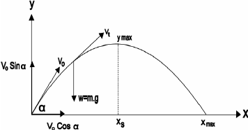
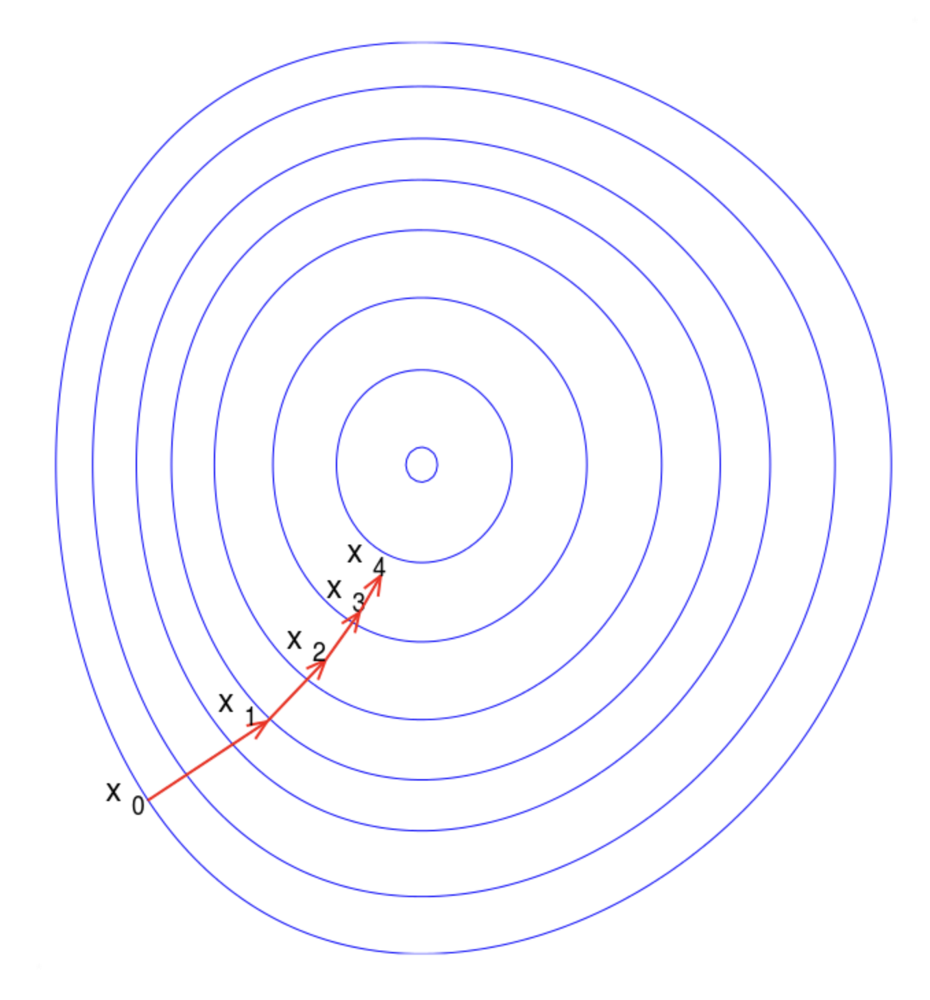
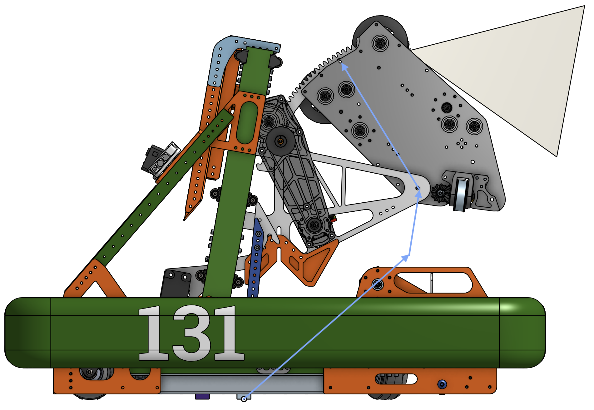

# Projectile Launcher Models

Last Updated: May 2024

## Introduction

A common theme in First Robotics is to launch game pieces into openings. This is one of those things that's easier said than done, and requires precise alignment and positioning, and a strong understanding of physics to solve.

## Relative Motion: Vector Addition

There are many reference frames to use when talking about movement, but picking a specific reference frame and staying consistent (and being able to swap between them) is important for advanced robotics, rocket science, and a whole lot more.

You can sit on a train, playing with marbles on a table top, and what you perceive as a marble moving 1 meter per second away from you, is in fact a marble moving 1 meter per second faster than a train. This scales up into 3 dimensions cleanly, and a marble moving away from you and to the left at 1.2 meters per second is also moving forward and left more than the train is. This can be represented as something called Vector Addition.

There's a video from the show Mythbusters that [illustrates this](https://www.youtube.com/watch?v=BLuI118nhzc) decently well. Bonus points if you recognize what Kari Byron yells out. They are trying to see if they released a ball backwards at the same speed as the vehicle it's on is moving, will it stay stationary relative to the ground the truck is driving over? You see, these are two different reference frames, one is with respect to the truck, and the other is respect to the ground. No matter how you setup your equation, the terms should cancel out, and the relative ground speed between asphalt and the ball is 0.

That's a really trivial case though, what happens in the more _real world_ environments? Well, the same thing really. Instead of adding single values together, you add multiple ones. See the diagram below, and observe that the x and y values are both going through the same thing.

<p align="center"></p>

Seen here as: _actual = aim+moving_

If you were to take the _moving_ vector and add it to the _aim_ vector, you would get the _actual_ vector. You can line this up visually and take the tail of the _moving_ vector (side without the arrow) and place it over the tip of the _aim_ vector (side with the arrow tip), and see how the tip of the _moving_ vector touches the tip of the _actual_ vector. This is a core concept of Linear Algebra, and also a (very) basic building block of another important topic called transfer alignment.

More formally, this can be written as:

$$ v_{final} = \sum_v v $$

Kinda simple, right?

## Kinematic Equations

<p align="center"></p>

Relative release angles are cool and all, but what happens after the piece is up in the air in free fall? It experiences a different type of motion called a parabolic trajectory. These can be calculated with a series of equations listed below.

$$
\begin{aligned}
\Delta x &= (\frac{v_f+v_0}{2})t \\
\Delta x &= v_0t + \frac{1}{2}at^2 \\
   v_f^2 &= v_0^2 + 2a \Delta x \\
     v_f &= v_0 + at
\end{aligned}
$$

Some of these are quite linear, by being able to drop larger polynomial terms we get equations like the last one. These are very powerful when used efficiently. They can also be used in pieces, solving for one thing, then swapping to another to leverage that intermediate value.

For instance, you can calculate the time in the air given a launch vector by using $\cancel{v_f}0 = v_0 +at$, pair it with $\Delta x = (\frac{\cancel{v_f}+v_0}{2})t$ for the first half of an arc, then solve for the second half with $\Delta x = \cancel{v_0t} + \frac{1}{2}at^2$. Solving it this way also cancels out many terms in the process. You can also substitute the equations into eachother to derive new ones, however that frequently just derives one of the others. Maybe you don't have $v_0$ but you do have $v_f$. You can turn the second equation into $\Delta x = (v_f-at)t+\frac{1}{2}at^2 = v_ft-\frac{1}{2}at^2$. Maybe that's more useful to you, or maybe it's not, but that's the power of algebra!

## What To Solve For?

If you're thinking ahead, you can typically reduce the problems to a lower dimension, or solve for a specific case. If you notice above, some equations cancel one term or another out. For instance, notice how the first kinematic equation listed doesn't include an acceleration? How about the last one not having a distance variable? This is powerful, because it allows you to setup solutions to specific problems.

### Vertical Velocity At A Height

One thing you might want to accomplish is launching at a higher target, and guaranteeing a certain velocity at a desired height creates constraints that can make the calculations simpler. Lets take a trip and break down all of this step by step.

By focusing on the velocity at a specific height, you can solve for the time to reach that height since that time value plays two parts. (1) It can be passed into other functions to generate more values, and (2) it can convert translational vectors into linear motion vectors. If you look at the list of 4 equations above, none of them quite fit our needs. But we do have the tools to calculate time via another important step in this process. We can calculate our initial vertical velocity based on gravity, and the vertical distance to rise.

$$
\begin{aligned}
v_f^2 &= v_0^2 + 2a \Delta x \\
v_0 &= \sqrt{v_f^2 - 2a\Delta x}
\end{aligned}
$$

This can then be used in one of the original equations to calculate the time to that velocity.

$$
\begin{aligned}
v_f &= v_0 + at \\
t &= \frac{v_f-v_0}{a}
\end{aligned}
$$

That's great! You now have the vertical velocity component for our 3 dimensional launch vector, _AND_ you know how long it will be in the air. The other terms can be deduced to match the units and context.

We need to solve the horizontal velocity components now. What's convenient about this technique is that we can calculate the horizontal distance, and convert that into a velocity component to plug into our launch vector. There's one catch, what if our robot is moving while it's launching? Think back to the earlier sections! We only have a parabolic curve in the vertical direction because we don't have any acceleration in the horizontal directions. In other words, when we add our motion vectors together, we get an effective vector, which also means that we can remove one vector from another as well.

So as you can see below, we take the ground distance, divide it by the time value we found earlier to establish the velocity needed to reach that distance in the correct amount of time. Then we can subtract the robots velocity in the same field coordinates to counteract the influence it will have in reality.

$v = \frac{target_{position}-current_{position}}{t} - current_{velocity}$

Tada! In just 4 equations, you have calculated a velocity release vector. Below, you can see the equations put together in python, or the entire python script and demo in [speaker.py](speaker.py). Along with the example code is [a video](speaker.mov) demonstrating it.

```python
# Calculate velocity needed to reach a target height and speed along the span
v0 = math.sqrt(end_velocity * end_velocity - 2 * GRAVITY[Z] * (target_position[Z] - current_position[Z]))
t = (end_velocity - v0) / GRAVITY[Z]

ground_vector = target_position - current_position
ground_vector[Z] = 0

final = ground_vector / t - current_velocity
final[Z] = v0
```

One thing that's interesting about this solution is that if you pass a negative velocity target, the calculated release arc will continue over the hill. Move the position and velocity sliders around and mess around with the variables in the python script to see how that would affect the release trajectory. Does it all pass the gut check?

### Location Given An Angle

Another situation might be launching _over_ something. You aim up high, and figure out the curve that will match the location you want the projectile to land on. While there are lower angles that can produce the desired landing spot, a higher angle is more likely to "stick the landing". Any fixed angle will work, but the larger angle is more likely to be useful.

So lets assume we're launching at a known max angle, and we know both our height difference, and our ground distance. This means we know the ratio between our vertical and horizontal speeds, and can substitute one for the other. Lets see where this takes us!

<p align="center"></p>

Lets note the important relationship between the X and Y values of $v_0$.

$$
\begin{aligned}
\hat{y} = sin(\theta)v_0 \\
\hat{x} = cos(\theta)v_0 \\
\hat{y} = \frac{sin(\theta)}{cos(\theta)}\hat{x}
\end{aligned}
$$

Our horizontal distance equation is relatively straight forward. The time it takes for the projectile to travel horizontal is just the distance traveled divided by the speed.

$$
\begin{aligned}
t = d/\hat{x}
\end{aligned}
$$

Our vertical and second equation is a little more complex. We can't easily break this problem up into parts like we did before, it just doesn't have a clear and direct path to the answer. So lets see what we can substitute and rearrange to get somewhere nice.

$$
\begin{aligned}
\Delta x &= v_0t + \frac{1}{2}at^2 \\
h &= \hat{y}t + \frac{1}{2}at^2 \\
\end{aligned}
$$

Now lets remember that we can substitute something in for $\hat{y}$

$$
\begin{aligned}
h &= \frac{sin(\theta)}{cos(\theta)}\hat{x}t + \frac{-9.81}{2}t^2 \\
\end{aligned}
$$

We still have 2 unknown variables still. This sounds like a difficult problem, but it's really not. What else could you substitute in here that would fit our needs? With just one more substitution, you can then simplify and solve for $\hat{x}$.

After solving that, and remembering what we said about vector addition and launching into the speaker while moving, what would you do to to the launch vector so that we could shoot on the move here too?

This type of problem involves something called systems of equations. We have taken 2 different but tightly coupled equations that may or may not have a solution, and found a solution that fits the intersection of both. Substitution is a very powerful technique that works with simpler scenarios, and luckily this case is just simple enough for it to work.

To see an example of this in python, see [landing.py](landing.py).

### Full Model: Iteration to Convergeance

One issue with the earlier models is that they work well with classical objects. You know the type, bowling balls and frictionless spherical cows. Once we start to scale things up and add more complex physics (like fluid dynamics, n-body style mechanics, or air resistance), it becomes easier to model the process as a multi-round monte carlo simulation (try it with random values), or a something called a gradiant descent model. For this, we'll use a greedy form of gradient descent.

Gradient Descent is basically just a measurement of slope, and trying to move "downhill".

<p align="center"></p>

Here you can see a 2d example that looks sort of like a bullseye. If you've ever seen a topological or height map (for instance the lines around a mountain peak on a map) you will see the same effect here. The middle ring is the lowest value, and each ring around it is a "higher point" in the data.

As algorithm designers, we can choose what those values are, and how they related to our problem set. So lets put a little bit of thought into this then! As the projectile travels the length of the arc, we can plot the minimum distance of that curve to the target location. We will make incremental adjustments to get there, and eventually we will get within a tolerance. This is what the name iteration to convergeance means, iterate until the values stop changing a meaningful amount.

## What Remains

Robots typically don't function in terms of velocity vectors. We've figured out how to calculate an arc from 1 point to another, but not how to use it in reality. That is a problem that's robot dependent. So lets talk about them at a high level.

### Transfer Alignment

This is the synchronization between a launcher devices's coordinate frame, and the platform's origin. In FRC, we typically don't deal with transfer alignment at the same complexity as professional projects, but the core idea remains. We need to account for the sensor/encoder results, and relate them to the actual position of the launcher mechanism relative to the _inertial frame_ (aka, the robot origin).

<p align="center"></p>

In our 2024 robot design, we used 3 vectors and a few rotations to determine the release point as seen with the blue arrows above.

Each arrow describes some constant distance, or scalable distance, and a potential rotation around that point. If you imagine the lift moving up and down, you will see that middle blue arrow expand and shrink, however the other arrows will remain the same. By calculating each arrow individually, rotating them when necessary, and then adding them all together, you can calculate where the release point is relative to the robot origin at any given point.

You can see a similar set of calculations done in [RobotContainer's constructor](https://github.com/Manchester-Central/2024-Crescendo/blob/main/src/main/java/frc/robot/RobotContainer.java#L145C46-L145C62), where the rear camera has its offset handler defined. These are almost the same vectors as the one to the launcher's release point.

### Velocity to Mechanism

Motors rarely understand commands to "speed". What they do understand is a command to rotate, or move to position. This is another robot specific problem, but it's usually simple enough to convert RPM to velocity with some error. Trivially, that's just the number of rotations per second, times the circumference of the wheels delivering the force. Unfortunately physics has a nasty habit of complicating things, and there will always be some loss in the conversion.

Ideally, you would model this with a speed gun. However that's unlikely to be viable.

The next best way is to fiddle with the RPM value given a velocity, and see what value matches the target velocity. This is more or less how a lookup table (also called flywheel table) functions. The difference is that once that table is generated you can fit an accurate polynomial curve to the points which should be more precise than just a flywheel table.

Using this equation, you can bake in the loss and estimate the deviation in the model. Every mechanism that's converting energy suffers some loss, and we see loss in our 2024 robot's system by the vibrations in the note, and the skipping along the note's surface. We don't actually get the note to release at 100% conversion rate, but closer to 50%.
