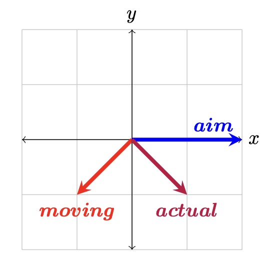
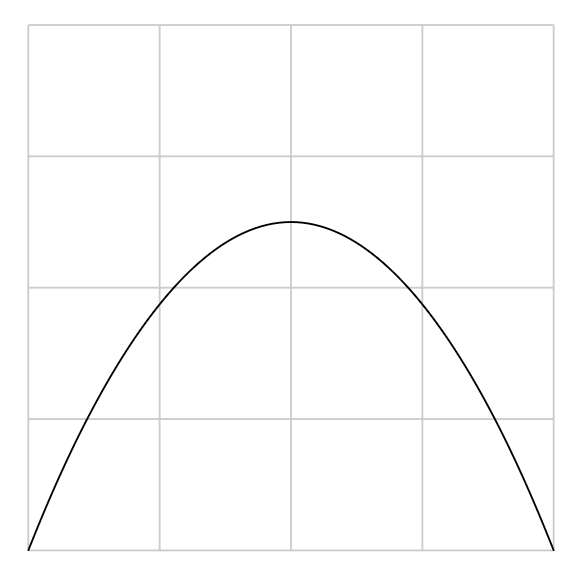

# Projectile Launcher Models

Last Updated: May 2024

## Introduction

A common theme in First Robotics is to launch game pieces into openings. This is one of those things that's easier said than done, and requires precise alignment and positioning, and a strong understanding of physics to solve.

## Relative Motion: Vector Addition

There are many reference frames to use when talking about movement, but picking a specific reference frame and staying consistent (and being able to swap between them) is important for advanced robotics, rocket science, and a whole lot more.

You can sit on a train, playing with marbles on a table top, and what you perceive as a marble moving 1 meter per second away from you, is in fact a marble moving 1 meter per second faster than a train. This scales up into 3 dimensions cleanly, and a marble moving away from you and to the left at 1.2 meters per second is also moving forward and left more than the train is. This can be represented as something called Vector Addition.

There's a video from the show Mythbusters that [illustrates this](https://www.youtube.com/watch?v=BLuI118nhzc) decently well. Bonus points if you recognize what Kari Byron yells out. They are trying to see if they released a ball backwards at the same speed as the vehicle it's on is moving, will it stay stationary relative to the ground the truck is driving over. You see, these are two different reference frames, one is with respect to the truck, and the other is respect to the ground. No matter how you setup your equation, the terms should cancel out, and the relative ground speed between asphalt and the ball is 0.

That's a really trivial case though, what happens in the more dynamic environments? Well, the same thing really. Instead of adding single values together, you add multiple ones. See the diagram below, and observe that the x and y values are both going through the same thing.



Seen here as: _actual = aim+moving_

If you were to take the _moving_ vector and add it to the _aim_ vector, you would get the _actual_ vector. You can line this up visually and take the tail of the _moving_ vector (side without the arrow) and place it over the tip of the _aim_ vector (side with the arrow tip), and see how the tip of the _moving_ vector touches the tip of the _actual_ vector. This is a core concept of Linear Algebra.

More formally, this can be written as:

$$ v_{final} = \sum_v v $$

Kinda simple, right?

## Kinematic Equations



Relative release angles are cool and all, but what happens after the piece is up in the air in free fall? It experiences a different type of motion called a parabolic trajectory. These can be calculated with a series of equations listed below.

$$
\begin{aligned}
\Delta x &= (\frac{v_f+v_0}{2})t \\
\Delta x &= v_0t + \frac{1}{2}at^2 \\
   v_f^2 &= v_0^2 + 2a \Delta x \\
     v_f &= v_0 + at
\end{aligned}
$$

Some of these are quite linear, by being able to drop larger polynomial terms we get equations like the last one. These are very powerful when used efficiently. They can also be used in pieces, solving for one thing, then swapping to another to leverage that intermediate value.

For instance, you can calculate the time in the air given a launch vector by using $\cancel{v_f}0 = v_0 +at$, pair it with $\Delta x = (\frac{\cancel{v_f}+v_0}{2})t$ for the first half of an arc, then solve for the second half with $\Delta x = \cancel{v_0t} + \frac{1}{2}at^2$. Solving it this way also cancels out many terms in the process. You can also substitute the equations into eachother to derive new ones. For instance, $(v_0 + at)^2 = v_f^2 = v_0^2 + 2a \Delta x$ which reduces down to $\cancel{v_0^2}+2v_0\cancel{a}t + a\cancel{^2}t^2 = \cancel{v_0^2} + 2\cancel{a} \Delta x$ &rarr; $2v_0t + at^2 = 2\Delta x$. Maybe this isn't what you're looking for, but being able to remove {$v_f$} from the equation is pretty handy in the right situation!

## What To Solve For?

If you're thinking ahead, you can typically reduce the problems to a lower dimension, or solve for a specific case. If you notice above, some equations cancel one term or another out. For instance, notice how the first kinematic equation listed doesn't include an acceleration? How about the last one not having a distance variable? This is powerful, because it allows you to setup solutions to specific problems.

### Vertical Velocity At A Height

One thing you might want to accomplish is launching at a higher target, and guaranteeing a certain velocity at a desired height creates constraints that can make the calculations simpler. Lets take a trip and break down all of this step by step.

By focusing on the velocity at a specific height, you can solve for the time to reach that height since that time value plays two parts. (1) It can be passed into other functions to generate more values, and (2) it can convert translational vectors into linear motion vectors. If you look at the list of 4 equations above, none of them quite fit our needs. But we do have the tools to calculate time via another important step in this process. We can calculate our initial vertical velocity based on gravity, and the vertical distance to rise.

$ v_f^2 = v_0^2 + 2a \Delta x $ &rarr; $ v_0 = \sqrt{v_f^2 - 2a\Delta x} $

This can then be used in one of the original equations to calculate the time to that velocity.

$ v_f = v_0 + at $ &rarr; $ t = \frac{v_f-v_0}{a} $

That's great! You now have the vertical velocity component for our 3 dimensional launch vector, _AND_ you know how long it will be in the air. The other terms can be deduced to match the units and context.

We need to solve the horizontal velocity components now. What's convenient about this technique is that we can calculate the horizontal distance, and convert that into a velocity component to plug into our launch vector. There's one catch, what if our robot is moving while it's launching? Think back to the earlier sections! We only have a parabolic curve in the vertical direction because we don't have any acceleration in the horizontal directions. In other words, when we add our motion vectors together, we get an effective vector, which also means that we can remove one vector from another as well.

So as you can see below, we take the ground distance, divide it by the time value we found earlier to establish the velocity needed to reach that distance in the correct amount of time. Then we can subtract the robots velocity in the same field coordinates to counteract the influence it will have in reality.

$ v = \frac{target\_position-current\_position}{t} - current\_velocity $

Tada! In just 4 equations, you have calculated a velocity release vector. Below, you can see the equations put together in python, or the entire python script and demo in [trajectory.py](trajectory.py).

```python
# Calculate velocity needed to reach a target height and speed along the span
v0 = math.sqrt(end_velocity * end_velocity - 2 * GRAVITY[Z] * (target_position[Z] - current_position[Z]))
t = (end_velocity - v0) / GRAVITY[Z]

ground_vector = target_position - current_position
ground_vector[Z] = 0

final = ground_vector / t - current_velocity
final[Z] = v0
```

One thing that's interesting about this solution is that if you pass a negative velocity target, the calculated release arc will continue over the hill. Move the position and velocity sliders around and mess around with the variables in the python script to see how that would affect the release trajectory. Does it all pass the gut check?

### Location Given An Angle

Another situation might be launching _over_ something. You aim as high up as possible, and figure out the curve that will match the location you want the projectile to land on.
