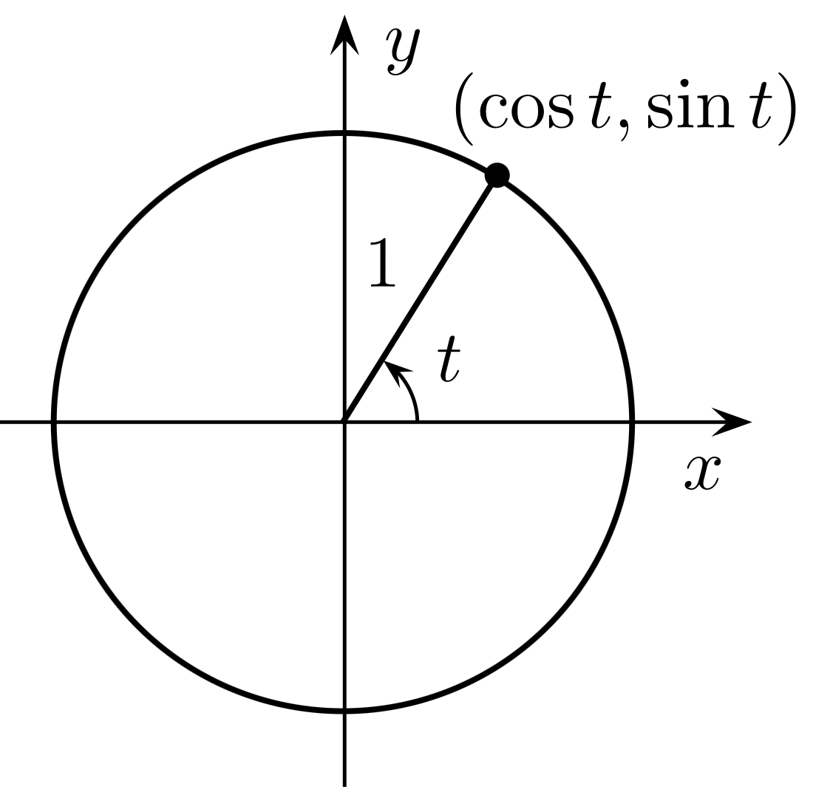
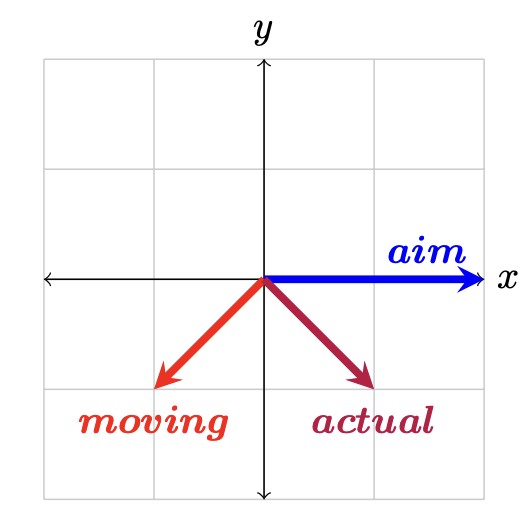

# General Math

Last Updated: July 2024

## Introduction

Robotics is a field that requires math. Like a _lot_ of it. It's one step below scientific simulations and computer graphics. It relies on a wide range of topics, but usually has a viable solution using only fundamentals. Lets go over many of the topics that come up in robotics, embedded systems, and primitive AI. Keep an eye out for bolded lines, they are questions you should be able to answer at that point.

## Geometry

Geometry is so critical to everything we do. Spatial reasoning, mechanical engineering, rushing through the grocery store as quick as possible, or maybe you recently found out just how many things can fit into [the square hole](https://www.youtube.com/watch?v=6pDH66X3ClA).

It is especially important to robotics and CAD software. Computer-Aided Design software is not explicitly a tool for laying out geometry with automated equations and analysis for engineers, but that is what the term has become. If you haven't taken a class on CAD from any mentors, give it a shot. It will expand your knowledge of robot design quite a bit!

### Trigonometry

This is the study on the relationship between triangles and circles. While at a surface level the two couldn't be _less_ similar, they are in fact tightly related by the way of right triangles and the unit circle. Pay close attention to the relationship between degrees and radians, $1\pi = 180^\circ$.

Lets get the unit circle out of the way first, it's a very special and powerful shape. The unit circle has a radius of 1, and its points can be represented in either cartesian coordinates (ie, $\{x,y\}$) or polar coordinates (ie, $\{\theta,r\}$). Note that in polar coordinates since the radius is always 1 it can be left off if stated.

What's great about this shape is that each point on the circle represents a pair of calculations: $\{x,y\}=\{cos(\theta),sin(\theta)\}$. Each can be derived from the other. This relationship comes up constantly in the real world, engineering, and physics, whether it's intended or not.

Now lets look at the right triangle. That previous relationship only holds true in a right triangle: a triangle with a 90 degree angle. This is because of the identity property of $1$. When you form the pythagorean equation with a unit circle, you see that $c=1$ and $1=a^2+b^2$. It may not seem like much, but this simple equation opens up a _lot_ of doors.

**Given value of a point on the unit circle, could you calculate the $y$ value if you know the $x$ value is $sin(\pi/6)$?** ($sin()$ is deliberate, keep your answer in terms of $cos()$ or $sin()$)

### Arc Length

Lets build off the idea of curved distances, and for simplicities sake we'll use a circle still. This is something called an [Arc Length](https://andymath.com/wp-content/uploads/2022/05/Screen-Shot-2022-05-17-at-12.14.25-PM.png). You can estimate the distance of an arc length by drawing a [_chord_](https://en.wikipedia.org/wiki/Chord_(geometry)) between two points on a circle, and calculating the length of that line. Since you've just graduate from Trigonometry School, you can calculate those two points along any circle. As a hint to make this simpler, you can actually tackle this problem by starting off with only 1 point because any arclength of radius $\theta$ has the same result at any spot on a circle, and the start of a circle is always at $\{r,0\}$ which is both a polar coordinate $\{r,\theta \}$ and a cartesian coordiate $\{x,y\}$. Once you have your second coordinate in cartesian values, observe that the coord is shorter than the arclength over those 2 points.

This is an estimate, and as you add more points and make smaller and smaller line segments, you get a total distance that grows and converges on the real value: $\theta_{radians} * r$.

**Knowing this, what would be the arc length of a circle over 138 degrees if that circle had a radius 3.5 times the radius of a unit circle?**

Congratulations! You've just stumbled upon the origin of Euler's Method (pronounced oiler), and one of the basic principles of calculus!

## Vectors

A vector is an organized set of values. Each position represents a specific dimension, or aspect of the data. For instance, when calculating the slope of a line on a graph, you may take the rise and divide it by the run. This is calculated from $y_2-y_1$ and $x_2-x_1$, right? This also just so happens to describe a vector, as seen below.

$$
\left\{
\begin{array}{l}
\Delta x \\
\Delta y
\end{array}
\right\}
$$

This extends into as many dimensions as you like. Including by 1 dimensional vectors (also called scalars), 3 and 4 element vectors like what are used in robotics and video games, or even 300 element vectors like in machine learning. All of the techniques we will talk about work across any sized vector. A vector is just an organized set of multiple numbers, that's it!

What's also nifty is that, while people typically use the x - y - z pattern, any order is valid so long as it's consistent. For the sake of this library, we will stick with the x - y - z pattern.

### Vector Addition

So we can describe a vector, so what? A lot, actually. Vectors are fundamental to a wide range of domains, and the most fundamental of all is vector addition. This is frequently called "tip to tail" as memorable visualization of the steps. You see when you place vectors tip to tail, and add the $\Delta x$ components together and then the $\Delta y$ components together, you get a new vector of $x$ and $y$ values. Take this image as an example.

This is an example of what happens when you add two velocity vectors together: $aim+moving=actual$. If you were to slide the $moving$ vector to the right, so that the tail of it touched the tip of the $aim$ vector, you would see the tip of $moving$ touch the tip of $actual$. So lets look at the numbers then: $aim$ is {2, 0}, $moving$ is {-1, -1}, $actual$ is {1, -1}.

**What is the structure of the equations to produce the correct result?** (Give both vector form, and individual equations for each element)

### Unit Vectors

There's a specialized type of vector called a unit vector, it's any vector with a magnitude/length of 1. There's a _big_ reason it's called a unit vector, and it _definitely_ ties back to the unit circle from before!

For a moment, take another glance at both the $moving$ and $actual$ vectors above. They have different x values, but still have the same length: $\sqrt{2}$. This is because vectors of any number of dimensions all obey pythagoras theorem: $a^2+b^2=c^2$, or $hypotenuse = \sqrt{a^2+b^2}$. For vectors of 1 dimension, the magnitude is itself. For vectors of 3 dimensions, the magnitude is $\sqrt{a^2+b^2+c^2}$, and so on.

Any vector can be _normalized_ to a unit vector by dividing it by its length, and the results are incredibly useful as you can see in other articles within the library. The terms become trigonometric values, and can be applied in a wide range of scenarios as a set of scalars, or in element wise operations.

### Dot Product

Unit vectors save the day.

### Cross Products

Crazy cousin of dot products.

### Basic Transformations

Lets only talk Affine

Translation is just vector addition.

Rotation is just trig.

Scaling is just.

### Matrix Transformations

Lets look at a rotation matrix.

### Homogenous Coordinates

How can we do all transformations at once? Lets look at limelight data.

## Physics

### Newtons Equations

### Torque

## Advanced Material

## Calculus

### Derivatives

### Integrals

## Statistics

### Standard Deviation

### Normal Distribution

## Probability

### PDF

## Here Be Dargons

From here the math gets more advanced. We have left the fundamentals and are touching on advanced materials that are required to make the robot work, but are hidden away in WPI Lib and other 3rd party tools.

## Camera Systems

### Lens Systems

### Focal Points

### Intrinsic Matrix

### Sensor Arrays
